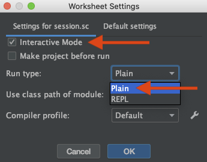

# Installation

1. Install [Java SDK 13](https://www.oracle.com/technetwork/java/javase/downloads/index.html)
2. Add java bin to your PATH if necessary. In my case java installed to `/usr/bin/java` and `usr/bin` was already on my path
    * For example: `export PATH="/PATH/TO/YOUR/jdk11-VERSION/bin:$PATH"`
3. Install sbt with homebrew: `$ brew install sbt`
4. Install IntelliJ CE
5. When it opens up go to Configure -> Plugins and install the Scala plugin and restart the IDE

The tutorial suggests opening a Scala Worksheet which was not available in my IDE. I Googled around and found [this solution](https://stackoverflow.com/a/36870897) on stackoverflow. It explains that you need to right click on the project on the left-hand side of the screen (ExampleProject for me) and select `Add Framework Support` then add Scala.


Lecture 1.1 - Programming Paradigms
===================================

Main programming paradigms:

* imperative
* functional
* logic

Orthogonal to it:

* object-oriented - Can be combined with any of the three above

## Imperative

* modifying mutable variables
* using assignments
* control structures like if-then-else, loops, break, continue, return

The most basic example of this is the Von Neumann computer:

Processor <-- bus --> Memory

This model has shaped the actual design of computers:

* mutable variables = memory cells
* variable dereferences = load instructions
* variable assignments = store instructions
* control strutures = jumps

How do we scale this up, in other words how can we avoid conceptualizing programs word by word?

_Reference: John Backus, Can Programming Be Liberated from the von. Neumann Style?, Turing Award Lecture 1978_

### Scaling up

We need other techniques for defining high-level absttractions such as collections, polynomials, geometri shapes, strings, documents..

Ideally we can develop **theories** of collections, shapes, and strings

### Theory

Consists of:

* one or more data types
* operations on these types
* laws that describe the relationships between values and operations

It does NOT describe mutations

#### polynomials example

`(a*x + b) + (c*x + d) = (a+b)*x + (b+d)`

there is no operator to change a coefficient while kepping the polnomial the same

#### strings example

The theory of strings defines a concatenation operator `++` which is associative:

`(a ++ b) ++ c = a ++ (b ++ c)`

it does NOT define an operator to change a sequence element while keeping the sequence the same

### Consequences for Programming

If we want to implement high-level concepts following their mathmateical theories, there is not place for mutation

## Functional Programming

Restrictive definition: programming without mutable variables, assignments, loops, and other imperative control structures

Less restrictive: Focusing on functions, where functions can be values that are produced, consumed, and composed

## Functional Language

Per the definition above, functions are first-class citizens which means:

* they can be defined anywhere, including inside other functions
* they can be passed in as parameters and be returned from a functions
* there are a set of operators to compose functions just as there are with other values (like strings and integers)

## Some functional programming languages

Strict:

* Pure Lisp, XSLT, XPath, XQuery, FP
* Haskell (without I/O Monad or UnsafePerformIO)

Wider:

* Lisp, Scheme, Racket, Clojure
* SML, Ocaml, F#
* Haskell
* Scala
* Smalltalk, Ruby

## Book recommendations

1. Structure and Interpretation of Computer Programs
2. Programming in Scala
3. Scala for the Impatient
4. Programming in Scala (O'Reilly)
5. Scala in Depth

## Why Functional Programming

* simpler reasoning principles
* better modularity
* good for exploiting parallelism for multicore and cloud computing


Lecture 1.2 - Elements of Programmming
======================================

Substitution model - all evaluation does is reduce an expression to a value and can be applied to all expressions **as long as they have no side effects**. This model is formalized in lambda calculus

## call by value

```scala
def square(x: Double) = x * x
def sumOfSquares(x: Double, y: Double) = square(x) + square(y)

sumOfSquares(3, 2+2)
sumOfSquares(3, 4)
square(3) + square(4)
3*3 + 4*4
9 + 16
25
```

Does every expression reduce to a value (in a finite number of steps)?

No -> `def loop: Int = loop`

The advantage of call-by-value is the it evaluates every function argument once

## call by name

The interpreter reduces function arguments to values before rewriting the function application.

one could alternatively apply the function to unreduced arguments:

```scala
sumOfSquares(3, 2+2)
square(3) + square(2+2)
3 * 3 + square(2+2)
9 + square(2+2)
2 + (2+2) * (2+2)
9 + 4 * (2+2)
9 + 4 * 4
25
```

The advantage of call-by-name is that a function argument is not evaluated if the corresponding parameter is unused in the evaluation of the body

## call-by-name vs call-by-value

Both strategies reduce to the same final values as long as:

* the reduced expression consists of pure functions and
* both evaluations terminate


Lecture 1.3 - Evaluation Strategies and Termination
===================================================

## Call-by-name and Call-by-value and termination

We know they reduce an expression to the same value but what if termination is not guarenteed?

If CBV evaluation of an expression e terminates then CBN evaluation of e terminates too. The reverse is not the case.


## Scals evaulation strategy

Scala normally uses call by value

In practice CBV is often exponentially more effcient than CBN and it plays nicer with imperative/side effects

But you can force CBN by adding an arrow in front of tha paramter type

`def constOne(x: Int, y: => Int) = 1`


Lecture 1.4 - Conditionals and Value Definitions
================================================

## Conditional Expressions

Used for expressions, not statements

`def abs(x: Int) = if (x >= 0) x else -x`

x >= 0 is a predicate

## Boolean rewrite rules

```
!true       -->  false
!false      -->  true
true && e   -->  e
false && e  -->  false
true || e   --> true
false || e  -->  e
```

short-circut evaluation meaning the right operand does not always need to be evaluated

```
if (true) e1 else e2    -->  e1
if (false) e1 else e2   -->  e2
```

## Value Definitions

The def form is by name where the right hand side is evaulated on each use

The val form is by value where the right-hand side of the val definition is evaluated at the point of the definition itself

```scala
def y = square(x)

// vs

val y = square(x) // evaluates to 4 right away
```

```scala

def loop: Boolean = loop

def x = loop // works
val x = loop // does not work
```

## and/or quiz

`def and(x: Boolean, y: => Boolean) = if (!x) false else y`

`def or(x: Boolean, y: => Boolean) = if (x) true else y`


Lecture 1.5 = Example: square roots with Newton's method
========================================================

When configuring an IntelliJ Scala Worksheet make sure to click the wrench icon and set the following:




Lecture 1.6 - Blocks and Lexical Scope
======================================

It is good functional programming style to split up a task into many small functions.

Functions like `sqrtIter`, `improve`, and `isGoodEnough` only matter for the implementation, not the usage. Consequently we normally would not give users access to these functions directly.

We can achieve this and avoid name-space pollution by putting auxcillary functions inside the `sqrt` function.

## Blocks in Scala

BLock is delimited by braces in scala `{ ... }`

It contains a sequence of definitions or expressions and are expressions themsevles

Definitions are only visible from within the block

The definitions inside the block **shadow** definitions outside of the block

## Semicolons

They are optional. Don't use them unless there are multiple expressions on one line.


Lecture 1.7 - Tail Recursion
============================

If a function calls itself as its last action, the function's stack frame can be reused. This is called **tail recursion**.

This is just another type of iterative process -- essentially the functional version of a loop. This reuses the stackframe of the function and so it can execute in constant stack space (just as efficient as a loop).

Tail recursive:

```scala
def gcd(a: Int, b: Int): Int =
    if (b == 0) a else gcd(b, a % b)

// evaluation
gcd(14, 21)
if (21 == 0) 14 else gcd(21, 14 % 21)
if (false) 14 else gcd(21, 14 % 21)
gcd(21, 14 % 21)
gcd(21, 14)
if (14 == 0) 21 else gcd(14, 21 % 14)
gcd(14, 7)
gcd(7, 0)
if (0 == 0) 7 else gcd(0, 7 % 0)
7
```

NOT tail recursive:

```scala
def factorial(n: Int): Int =
    if (n == 0) 1 else n * factorial(n - 1)

// evaluation
factorial(4)
if (4 == 0) 1 else 4 * factorial(4 - 1)
4 * factorial(3)
4 * (3 * factorial(2))
4 * (3 * (2 * factorial(1)))
4 * (3 * (2 * (1 * factorial(0))))
4 * (3 * (2 * (1 * 1)))
```

## Tail recursion in Scala

Only directly recursive calls to the current function are optimized.

One can require that a function is tail-recursive using a `@tailrec` annotation. This raises an error for implementations that are not tail recursive.

```scala
@tailrec
def gcd(a: Int, b: Int): Int = ...
```

### Tail recursive version of factorial

```scala
def factorial(n: Int, m: Int = 1): Int =
    if (n == 0) 1 else 
```

# week 1 homework notes

recursion is confusing
